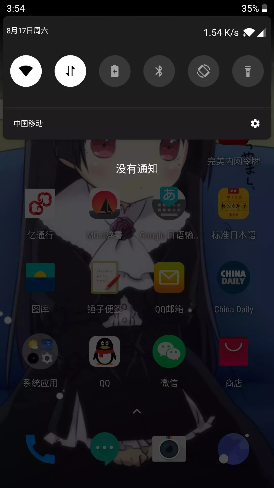
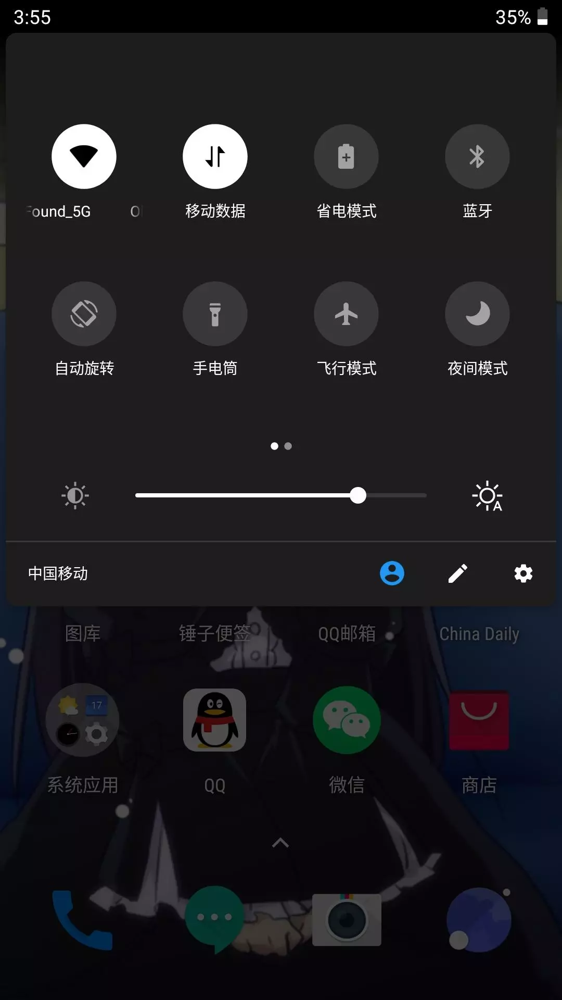

机型：iPhoneXR

# 弃用理由

根据对我个人的使用影响由高到低排

## 1\. IOS版锤子便签的bug

1.  卡顿问题：每次进入app后的第一次操作（打开便签、编辑后保存便签、切换文件夹）均会卡3～4秒钟。其中“进入app”的定义为：第一次打开app、从锁屏界面解锁进入app、从其他应用切回app。
2.  同步问题：经常出现感叹号标志，导致重复标签问题。
3.  “上次退出时所处的文件夹”的记忆功能

锤子便签安卓版本无这些问题。

锤子便签作为我的日程安排、重要信息等记录工具，是我最常使用的app，其IOS版的这些bug极大的影响了我的使用体验。

## 2\. 返回键的设计问题

IOS系统没有实体返回键，需要从屏幕左侧向右划来完成返回操作。

且根据我的不完全实验发现，IOS系统的右划返回并非像一加7pro那样的为系统级别的实现，而是应用级别的实现。所以不同app的触发精度是不一样的：qq和百度贴吧只要按住屏幕中间稍靠左部分右划即可（很好），而微信和Safari必须是从特别靠屏幕左侧右划才可以，后者这样的设计再加上iPhoneXR屏幕宽且机身厚、重，导致想通过单手右划来实现返回功能的失败率会很高。造成不流畅的感觉，十分影响体验。

看视频的时候想要退出全屏，因为没有实体返回键，所以只能点击屏幕唤出上栏，然后按左上角的返回键。

归根到底，IOS系统将“从屏幕左侧向右划”这个动作设计为返回键是有问题的原因是：“从屏幕左侧向右划”这个动作在特殊的场景（app）中是有意义的，如：播放视频中为拖动进度条；图片画廊中为滑到上一张图片；。这样的冲突设计，会导致要么返回键不可用，如播放视频中无法通过该动作返回，只能点击屏幕唤出上栏，然后按左上角的返回键（繁琐）。要么动作精细度要求会很高，如图片画廊中在最靠左侧的部分或图片之外的部分向右划判定为“返回”，否则判定为“上一张图片”。

“返回”作为手机使用中最常用到的一个功能，这样的设计明显是不合理的。实体返回键是很有必要的，这样无论任何场景，我在想要“返回”的时候，只需要无脑按返回键即可。就算为了全面屏而取消实体返回键，也应该像一加7pro一样，将返回键定义为手势“从屏幕右下角上划”（与其他手势不冲突）或“从屏幕右侧下方左划”并提供系统级支持（方便右手单手操作，且各app间的一致使用体验）。

## 3\. 面部识别而非指纹识别

首先明确一下“识别”的目的：“识别”是就是为了做权限认证（屏幕解锁，支付确认、部分敏感app的认证如：手机银行、完美世界内网令牌等）

作为一个普通人，应用在手机上的识别，谈“识别率”真的意义不大，因为指纹识别和面部识别都已足够好。我所关心的只是：

1.  速度：越快越好，这也是为什么指纹识别优于密码识别的原因，不用输密码了，快！方便！
2.  成功率：尽量在任何场景下都要能解锁，且成功率要有保证，不然我还得输密码，麻烦。

下面就谈谈为什么我认为指纹识别要优于面部识别：

1.  速度方面：根据我的使用体验，指纹识别和面部识别都很快，并没有明显的差距。
2.  成功率方面：虽然苹果宣称“在全黑的条件下也可以成功识别”、“化妆、戴眼镜等等也可以成功识别”blabla。但是根据我的实际使用体验，有很多时候，解锁会失败。如：午休的时候趴在桌子上我想打开手机瞅一眼时间。晚上睡觉前侧躺着想打开手机看一眼时间。等等。

经过思考后我发现其实归根到底，我感到难受的原因是在逻辑方面的原因：

用指纹解锁是一个主动的过程：伸手指 → 按 → 解锁，而如果解锁失败了（实际上几乎没有出现过这种情况），不用想，我会直接认为是手机的问题，然后选择输密码来解锁。

而使用面部识别解锁是一个被动的过程：正对屏幕 → 等iPhone来扫我 → 解锁，而如果解锁失败的话，我会怀疑：是手机卡了吗？是不是脸没正对屏幕？遮脸了？环境太黑了？等等。然后我会陷入选择：是调整一下姿势把脸正对屏幕？还是干脆输密码得了？对于解锁屏幕这种每天要进行几十上百次的操作来说，这样就会很难受。

## 4\. 后台杀进程的问题

即使我只打开着qq、微信、锤子便签三个应用，过段时间，系统就会给我把锤子便签给杀了。或者如果开着别的应用有时还会给我把qq、微信给杀了。虽然重新打开app也很快，浪费不了几秒钟，但是，毕竟打开app还是会有开启动画，会停留那么一下下，怎么说呢，就很难受。

安卓就没这种问题（至少我的一加5就没这种问题），只要内存够，就不会杀我的后台进程。

## 5\. 手机很笨重，真的不方便单手操作

# 其他的一些设计问题

## 1\. 神奇的静音模式和闹钟问题

iPhone在机身左侧提供了拨动式实体键来控制响铃/静音模式，关于这两种模式在Apple官网上有如下描述：

> 将 iPhone 设置为响铃模式时，铃声、提醒和声音会通过 iPhone 扬声器播放。 将 iPhone 设置为静音模式时，您不会听到任何铃声或提醒，但是其他声音会通过 iPhone 扬声器播放且 iPhone 会振动。 这些设置仅会影响 iPhone 扬声器。如果您使用耳机，那么即使 iPhone 处于静音模式，声音也会通过耳机播放。

关于静音模式需要注意的是静音模式禁的只是**来电铃声**和**提醒**（微信消息提醒声等），音乐等**媒体声音**是不禁。

且还有一点需要特别注意的是，虽然在以上描述中说了“将 iPhone 设置为静音模式时，您不会听到任何铃声或提醒”，但其实静音模式是**不禁闹钟铃声**的（？闹钟铃声不算铃声？），且更神奇的是如果你戴着耳机（有线 or 蓝牙），闹钟铃声会在iPhone扬声器和耳机同时响起。。。（神设计）。

更甚，在闹钟app中选择铃声的时候，其铃声行为也与上述闹钟铃声一致，即手机扬声器和耳机同时响。

为了理解以上设计的诡异性，请考虑如下场景：你在午休时分想要选择一个闹钟铃声，为了不打扰到别人，你佩戴着耳机，然后开始选择铃声。结果将会是：铃声会在手机扬声器和耳机同时响起，且因佩戴着耳机，你还不会知道铃声其实是在手机扬声器上也在响的。。。

而且“午休时刻，戴上耳机睡觉，希望闹钟只在耳机响把自己叫醒，而不要外放吵到别人”这种需求是无法实现的。（workaround：闹钟铃声选择为“无”，将手机放到口袋里靠震动把自己叫醒）

IOS系统中关于声音的设计记录如下：

IOS系统的设计中，声音的类型分为以下几种：

1.  来电铃声和提醒（通知中心的通知提醒声）
2.  媒体声：音乐、视频
3.  闹钟铃声

关于声音的音量控制，“来电铃声和提醒”、“闹钟铃声”是归属一类，默认不受音量控制键的影响，需到“设置 → 声音与触感 → 铃声和提醒一栏”中设置。“媒体声”的音量由音量控制键控制。

参考：

*   静音模式：[https://support.apple.com/zh-cn/HT208353](https://support.apple.com/zh-cn/HT208353)
*   闹钟：[https://support.apple.com/zh-cn/HT207512](https://support.apple.com/zh-cn/HT207512)

## 2\. 顶栏的设计

在iPhone XR的设计中与顶栏相关的有两个：通知中心和控制中心。顶栏右侧下滑为控制中心，顶栏中部或左侧下滑为通知中心。同一个手势但唤出不同的结果，这样的设计，我并不认同，特别是在横屏状态下，顶栏是平齐的，同一个手势在左侧和右侧划，划出来的东西居然不一样，会让人感到困惑。

而一加H2OS中的设计我认为更好一点：H2OS将通知中心和控制中心放一起了，控制中心在上，通知中心为透明在控制中心下方。这样顶部下划，划出的东西是一样的。

再次下划，展开控制中心：

还有一点就是通知中心的问题：

在iPhone的设计中，通知中心的通知，点击或向左划为打开，向右划（还得划大一点）选择“打开、”“管理”、“清除”。这样最常用的“清除”就得需要两步（右划 + 点击清除按钮）才可以实现，很繁琐。

## 3\. 没有耳机孔

# iPhone的优点

1.  iPhone有app store统一生态，而安卓在中国没有google play store。
2.  拍照真的好。

# 使用中遇到的其他问题

外观：

1.  后边的相机凸起真是惨不忍睹。必须要戴手机壳才可以，不然真怕给镜头磨坏了。
2.  手机机身真厚，感觉很笨重，单手操作起来真的很费劲。

配件：

1.  自带充电器不支持快充，想要快充还得另买充电头（真抠门啊，苹果）。

顶栏：

1.  不显示电量百分比，需要到控制中心下拉菜单中才能看到。
2.  没有网络流量实时速度，即使在控制中心也查不到。

安卓数据转移至iphone：

1.  使用“转移至iphone”app转移数据，只能在设置新iPhone时才可以使用，如果设置已完成，要么抹掉重新设置，要么自己手动转移。
2.  “转移至iphone”app只有谷歌商店才有，中国用户还得手动下载.apk安装。
3.  转移过程有问题，安卓手机上总提示“无法与设备通信”。解决：手动操作，将安卓手机连上iPhone的热点，然后再转移就好了。iPhone的热点名为“iphone xxxxx”，密码和名字一样。
4.  导入的通讯录没有按名字首字母分组。把系统语言调成英文然后再改回去就好了。
5.  从安卓导入iphone，图片整理逻辑很迷，全乱了。丢失了我之前的文件夹组织。

失望之处：

1.  app打开界面还是有广告啊！！！
