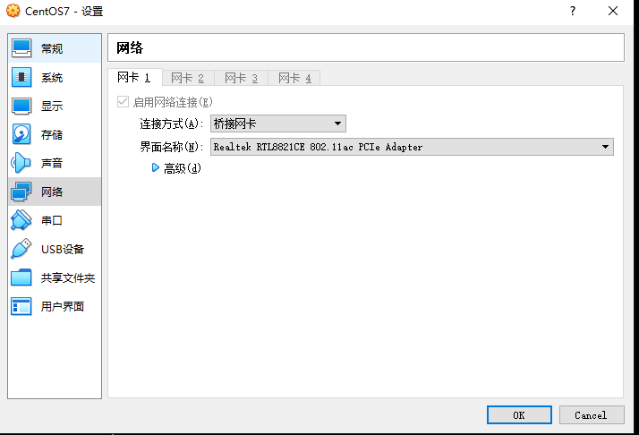

# 简介
本文使用 VirtualBox 安装 CentOS7 虚拟机，并设置 CentOS7 虚拟机网卡使用“桥接网络”模式和静态 IP，方便宿主机使用 ssh 连接。


# 准备工作
1. 到 [VirtualBox官网](https://www.virtualbox.org/) 下载 VirtualBox 并安装。
2. 到 [CentOS官网](https://www.centos.org/) 下载 CentOS7 系统镜像。如果下载速度慢的话，也到国内镜像网站下载如：[清华镜像源](https://mirrors.tuna.tsinghua.edu.cn/)。


# 在 VirtualBox 中安装 CentOS7 系统
就是基本的系统安装流程，并没有什么特别需要注意的，故省略不表。


# VirtualBox 网络
VirtualBox 有多种虚拟机网卡模式：网络地址转换（Network Address Translation (NAT)），Network Address Translation Service，桥接网络（Bridged Networking），内部网络（Internal Networking），仅主机网络（Host-Only Networking）等。

在这里我们只简单介绍“网络地址转换”（Network Address Translation (NAT)）和“桥接网络”（Bridged Networking）。

VirtualBox 虚拟机默认的网卡模式为“网络地址转换”。在这种模式下，我们的虚拟机可以访问到宿主机，也可以访问外部网络。但是虚拟机没有 IP 地址，宿主机无法访问到虚拟机。

而在“桥接网络”模式下，我们的虚拟机相当于是和宿主机使用网线连接了起来，二者处于同一个网络段中。在这种模式下，虚拟机和同一网络下的物理机没有什么区别，虚拟机有自己的 IP 地址，宿主机和外部网络可以访问到虚拟机，虚拟机也可以访问到宿主机和外部网络。


# 配置虚拟机网络
首先，我们在 VirtualBox 中打开并连接到 CentOS7 虚拟机，并使用命令确认网络正常，如下：
```
$ curl http://www.baidu.com
```

然后我们打开 VirtualBox 虚拟机“设置”，进入“网络”设置栏，将“网卡连接方式”从“网络地址转换（NAT）”改为“桥接网卡”，最终结果应该同下图：


配置完成后我们可以使用 `ip` 命令查看虚拟机的网络接口，如下：
```
$ ip a
1: lo: <LOOPBACK,UP,LOWER_UP> mtu 65536 qdisc noqueue state UNKNOWN group default qlen 1000
    link/loopback 00:00:00:00:00:00 brd 00:00:00:00:00:00
    inet 127.0.0.1/8 scope host lo
       valid_lft forever preferred_lft forever
    inet6 ::1/128 scope host
       valid_lft forever preferred_lft forever
2: enp0s3: <BROADCAST,MULTICAST,UP,LOWER_UP> mtu 1500 qdisc pfifo_fast state UP group default qlen 1000
    link/ether 08:00:27:d5:51:35 brd ff:ff:ff:ff:ff:ff
    inet 192.168.31.6/24 brd 192.168.31.255 scope global noprefixroute dynamic enp0s3
       valid_lft 42638sec preferred_lft 42638sec
    inet6 fe80::bee7:ef4a:fee4:a050/64 scope link noprefixroute
       valid_lft forever preferred_lft forever
```

可以看到在接口 `enp0s3` 中，我们的虚拟机 IP 地址是：`192.168.31.6`。

然后我们就可以在宿主机上使用 IP 地址 `192.168.31.6` 访问到虚拟机了，如下：
```
$ ping 192.168.31.6
PING 192.168.31.6 (192.168.31.6) 56(84) bytes of data.
64 bytes from 192.168.31.6: icmp_seq=1 ttl=64 time=0.026 ms
64 bytes from 192.168.31.6: icmp_seq=2 ttl=64 time=0.077 ms
64 bytes from 192.168.31.6: icmp_seq=3 ttl=64 time=0.077 ms
64 bytes from 192.168.31.6: icmp_seq=4 ttl=64 time=0.076 ms
^C
--- 192.168.31.6 ping statistics ---
4 packets transmitted, 4 received, 0% packet loss, time 2999ms
rtt min/avg/max/mdev = 0.026/0.064/0.077/0.021 ms
```

当然，我们也可以在宿主机上使用 ssh 连接到宿主机了：
```
$ ssh root@192.168.31.6
```


\-----------------------
# 注：在桥接网络模式下，将虚拟机网络由 DHCP 改为静态 IP 后就无法访问外部网络了，不清楚原因。以下内容暂时作废。


# 设置虚拟机静态 IP：
在 CentOS7 默认网络配置中，虚拟机的 IP 地址是网络中的 DHCP 服务器动态分配的，每次虚拟机重启，可能就会被分配一个不同的 IP 地址。这样我们每次想要通过宿主机 ssh 连接虚拟机，都需要先使用 VirtualBox 连接上去查看其 IP 地址是多少，很不方便。

我们希望将虚拟机的 IP 地址固定下来。

这可以通过配置 CentOS7 系统的网络来实现，具体步骤如下：

首先，我们先备份网络配置：
```
$ cp /etc/sysconfig/network-scripts/ifcfg-enp0s3 .
```

注意：网络配置文件的名称格式为 `ifcfg-xxx`，在本文示例中我的配置文件叫 `ifcfg-enp0s3`，在你的系统中不一定就是这个名字，需要你先使用 `ip a` 命令查一下网络接口名。

然后我们修改 `ifcfg-enp0s3` 文件，原文件为：
```
TYPE="Ethernet"
PROXY_METHOD="none"
BROWSER_ONLY="no"
BOOTPROTO="dhcp"
DEFROUTE="yes"
IPV4_FAILURE_FATAL="no"
IPV6INIT="yes"
IPV6_AUTOCONF="yes"
IPV6_DEFROUTE="yes"
IPV6_FAILURE_FATAL="no"
IPV6_ADDR_GEN_MODE="stable-privacy"
NAME="enp0s3"
UUID="5f089fc9-2695-4816-8105-ac82edd160b7"
DEVICE="enp0s3"
ONBOOT="yes"
```

我们需要
1. 将 `BOOTPROTO="dhcp"` 修改为：`BOOTPROTO="static"`。
2. 加上一行：`IPADDR=192.168.31.6`，这里的 IPADDR 的值为你想要设置的静态 IP 地址。


最后，重启网络服务：
```
$ systemctl restart network
```

这样就将 CentOS7 虚拟机设置为了静态 IP。

更进一步，我们还可以为虚拟机起一个方便记忆的域名如“centos7”，将这个域名与其静态 IP 地址关联起来（写入宿主机的 host 文件或 ssh 配置文件中），这样我们就可以使用 `ssh root@cnetos7` 命令直接连接到虚拟机了。

ssh 的使用和配置可以参考这篇文章：[ssh的简介与常用用法](./2020-01-09-ssh的简介与常用用法.md)


# 参考
- [VirtualBox虚拟机网络设置（四种方式） ](https://www.douban.com/group/topic/15558388/)
- [virtualBox实现主机和虚拟机相互ping通,配置静态IP地址](https://blog.csdn.net/u010486658/article/details/70871940)
- [SSH连接virtualbox中的虚拟机](https://www.cnblogs.com/lxg0/p/6413965.html)
- [VirtualBox Manul-Chapter 6. Virtual Networking](https://www.virtualbox.org/manual/ch06.html)
