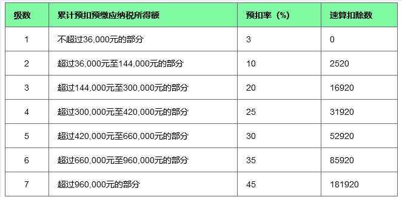

# 个人所得税算法bug

## 年终奖税款的两种计算方式

今日看到一则睡前消息:

> 个人所得税优惠政策顺延2年 年终奖不按月薪计税：
>
> 12月29日召开的国务院常务会议对2022年春运疫情防控工作进行部署。
>
> 为减轻个人所得税负担，缓解中低收入群体压力，会议决定，**一是将全年一次性奖金不并入当月工资薪金所得、实施按月单独计税的政策延至2023年底。**二是将年收入不超过12万元且需补税或年度汇算补税额不超过400元的免予补税政策延至2023年底。三是将上市公司股权激励单独计税政策延至2022年底。上述政策一年可减税1100亿元。

目前年终奖的计税方式有两种，一种是不并入全年综合所得，按月单独计税。一种是并入全年综合所得来计税。

前者的政策来源是 2005 年发布的《国家税务总局关于调整个人取得全年一次性奖金等计算征收个人所得税方法问题的通知》（国税发[2005]9号）。

后者是在 2019 年 1 月 1 日，新的个人所得税法出台后，工资薪金的计税方法从原来的按月计算，改成了和其他收入一起纳入年度综合所得来计算，年终奖也统一纳入其中。

为了确保新旧政策平稳过渡，政府将旧的计算方法继续保持三年，至 2022 年 1 月 1 号。（财税〔2018〕164号《关于个人所得税法修改后有关优惠政策衔接问题的通知》）

也就是在 2022 年 1 月 1 号之前，纳税人可以选择两种方法中任意一种来为年终奖纳税。

上面那则新闻就是政府决定把旧的计税方式再次延长两年，到 2024 年 1 月 1 号。

## 年终奖按月单独计税

回想起自己去年的年终奖，感觉如果按月单独计税应该交不了那么多的钱，于是对算法产生好奇，故研究了一番，发现了目前政策计算方法存在的一个 bug。

先附上个人所得税的月度和年度税率表和各挡位的速算扣除数，如下：

月度税率表：

年度税率表：

单独计税的计算公式很简单：纳税额 = 年终奖 * 税率 - 速算扣除数，其中的税率是以年终奖除以 12 来确定的。

举个例子：

老王是一家 IT 公司的技术人员，2021 年每月工资 15000 元，五险一金个人承担 1000 元，专项附加扣除每月 2000 元。年终奖为 60000 元，不并入年度综合所得，采取按月单独计税的方法计算纳税额：

第一步：将年终奖平均到月，计算月收入：60000 ÷12 = 5000 元。

第二步：确定税率：位于 3000 元至 12000 元之间，故税率为 10%。

第三步：计算：年终奖应纳税额 = 60000 × 10% - 210 = 5790 元。

注意在第三步中减去的居然是月度的速算扣除 210 元而非年度的速算扣除 2520 元。

这是有问题的，假如年终奖位于税率档附近，稍微多发一点刚好跨入到下一个税率挡，就会按高的税率交税，但是减去的速算扣除提高却很小，导致纳税额大幅度提高。也就是媒体上说的“多发一块钱反而要多交几千块的税”的情况。

比如：

年终奖在 144000 时，纳税额为：144000 * 0.1 - 210 = 14190。

年终奖多发一块钱到 144001 时，纳税额为：144001 * 0.2 - 1410 = 27390.2。

多发一块钱，需要多交一万三的税！

这非常不合理，这种情况的产生归根结底是由于总值是按年算的，减去的速算扣除数却是使用的月的，这是不对的。假如我们使用的是年度速算扣除，就不会有这种问题，如下：

144000 * 0.1 - 2520 = 11880

144001 * 0.2 - 16920 = 11880.2

多发一块钱，需要多交的税款为 2 毛钱。这才是正确的、合理的计算方法。

根据自己在网上的搜索，和自己去年年终奖的纳税实际情况，都是按错误的计算方式算的。这其实是少扣除了 11 个月的速算扣除数，多纳了一部分税。

不太清楚为什么目前的情况会是这个样子。税务总局出的文件是没问题的，虽然确实没有说清楚速算扣除是月度的还是年度的，可能是税法政策执行过程中产生了问题，于是就一直沿用保持下来了？

## 年终奖纳入年度综合所得计税

最后再附上新的纳入年度综合所得的计算方法：

纳税额 = (收入 - 各项附加扣除 - 5000 元个税起征点) * 税率 - 速算扣除数。

还是以 IT 技术人员老王为例，他的年终奖如果纳入年度综合所得计算，需要交的税为：

全年工资应纳税所得额 = 15000 × 12 - (1000 + 2000) × 12 - 60000 = 84000 元。（注：这里的 60000 是 5000 元个税起征点 * 12 计算的 60000，不是年终奖的 60000）

全年工资应纳个税 = 84000 × 10% - 2520 = 5880元。

年终奖金 60000 元，并入综合所得：

全年综合所得应纳税所得额 = 60000 + 84000 = 144000元。

全年综合所得应纳个税 = 144000 × 10% - 2520 = 11880元。

年终奖金应纳税额 = 11880 - 5880 = 6000元。

## 参考：

- 睡前消息【2021-12-29】
- [个人所得税计算器](https://www.gerensuodeshui.cn/)
- [全年一次性奖金个人所得税月度税率表(有效期至2022年1月1日前)-个税计算器](https://www.gerensuodeshui.cn/view/2021-10-18/2bcab9d935d219641434.html)
- [2021年终奖个人所得税怎么计算-个税计算器](https://www.gerensuodeshui.cn/view/2021-10-10/860320be12a1c050cd77.html)
- [全年一次性奖金的两种计算方法-个税计算器2021](https://www.gerensuodeshui.cn/view/2021-10-24/b706835de79a2b4e8050.html)
- [百度百科-速算扣除数](https://baike.baidu.com/item/%E9%80%9F%E7%AE%97%E6%89%A3%E9%99%A4%E6%95%B0/1806493)
- [《国家税务总局关于调整个人取得全年一次性奖金等计算征收个人所得税方法问题的通知》（国税发[2005]9号）](http://www.chinatax.gov.cn/n810341/n810765/n812188/n812950/c1201370/content.html)
- [个税政策历史-知乎-捷税宝](https://www.zhihu.com/question/307248594/answer/2189317253)
